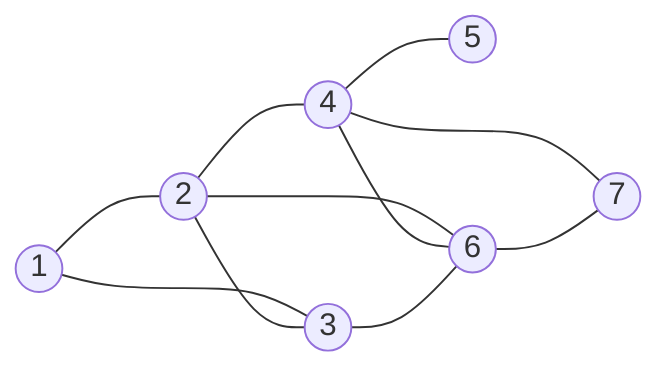
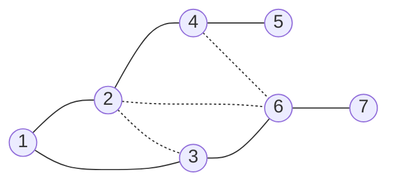

# Depth First Search
## Problem Definition

Consider the following undirected graph.


Say you want to go from $1$ to $7$. You want a traversal that will reliably and efficiently find this path.

## Algorithm Definition
The algorithm goes from the source, and picks nodes randomly. It doesn't go to any node twice, and backtracks when it reaches a dead end. Eventually, it will approach the desired node (provided the source and destination are connected to each other).

## Observations
* Since each node is visited only once, we can model the path that the algorithm travels over as a tree. This will be referred to as a DFS Tree.
* There are no cross-edges possible. If subtree $S1$ and $S2$ have no forward edges connecting them, this means that there is no edge present between $S1$ and $S2$ (otherwise, it would have been visited before backtracking). Therefore, any edge besides a forward edge is a back edge.



For example, one might think a graph with dotted edges as cross-edges here works. But, the algorithm must traverse $3$ and $6$ before backtracking from $2$, so it is invalid.

## Pseudo-Code
```
make an array with 'visited' flag for all nodes
make an array for visiting time of all nodes
start time t as 0

DFS(node v){
	mark node v as visited
	set time of visit as t
	increment t
	for every vertex w in adjacency list of v {
		if w is not visited {
			perform DFS(w)
		}
	}
}
```

## Runtime
* Each node has to be visited at least once before the algorithm ends.
* Each edge need not be visited before the algorithm ends. However, since we are using an adjacency list, each edge is checked twice.

This puts the total runtime as $O(V + E)$


