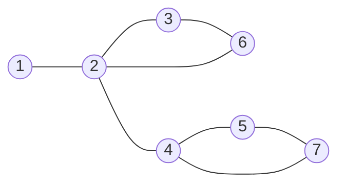

# Bridge Edge Detection
## Problem Definition
Consider the following graph


In this case, if we remove the edge $2-4$, we get two disconnected components. Therefore, $2-4$ counts as bridge edge. However, $2-6$ does not do this, so it's not a bridge edge.

We define a graph as 2-Edge Connected, If and only if it has no bridge edge. The problem, now, is to find whether or not a graph is 2EC.

## Observation
* Consider you are traversing $2-4$. We know that it is a bridge edge. We can remark that there are no edges moving up from the subraph below $4$ to the subgraph above $2$. If that were true, the edge would no longer be a bridge edge, because there would be two edges connecting the subgraph to $1$.
* Additionally, we only need to check backward edges, as a DFS tree is incapable of having cross edges.
* All we need to know about a subgraph to detect the bridge edge is the highest back-edge coming out of it.

## Pseudocode
```
define arrays for visited flags and visit time
define time as 0
define HBED (highest back edge destination) as 0

check-2EC([vertex v] -> HBED s) {
	mark v as visited.
	set time[v] and HBED as t++.
	
	for each (vertex w) in adjacency list of (v),
		if w is unvisited,
			reduce HBED to check-2EC(w) or pass.
		else,
			reduce HBED to depth of w or pass.
			
	if HBED is below or at v,
		report bridge edge and terminate.
	else, 
		report success.
}

```

## Runtime
As this algorithm is a small modification on depth-first traversal, it retains the same runtime of $O(E + V)$

